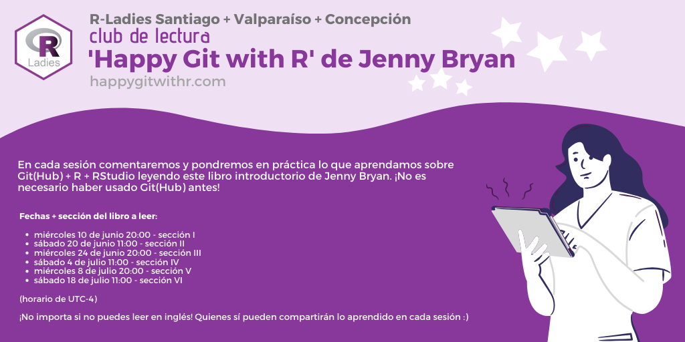

# Club de lectura: "Happy Git with R", de Jenny Bryan

## Sesión 1 - sección I: Installation
Miércoles 10 de junio - 20:00 UTC-4 | Sesión a cargo de [Macarena Valenzuela](https://twitter.com/macavalenzuela)

* [Video](https://vimeo.com/427950367)
* Materiales

## Sesión 2
Sábado 20 de junio - 11:00 UTC-4 | Sesión a cargo de [Riva Quiroga](https://twitter.com/rivaquiroga)

* Video (¡pronto!)

## Sesión 3
Miércoles 24 de junio - 20:00 UTC-4 | Sesión a cargo de [Natalia Riquelme](https://twitter.com/NatyRiquelmeS)

* [Video](https://vimeo.com/432356626)
* Presentación

## Sesión 4
Sábado 4 de julio - 11:00 UTC-4 | Sesión a cargo de [Riva Quiroga](https://twitter.com/rivaquiroga)

* [Video](https://vimeo.com/435508006)

## Sesión 5
Miércoles 8 de julio - 20:00 UTC-4 | Sesión a cargo de [Gabriela Sandoval](https://twitter.com/GabySandovalM) y [Camila Molina](https://twitter.com/calmolinafe)

* [Presentación](https://gabysandovalm.github.io/happy-git-r-sesion5/#1)
* [Video](https://vimeo.com/438011841)

## Sesión 6
